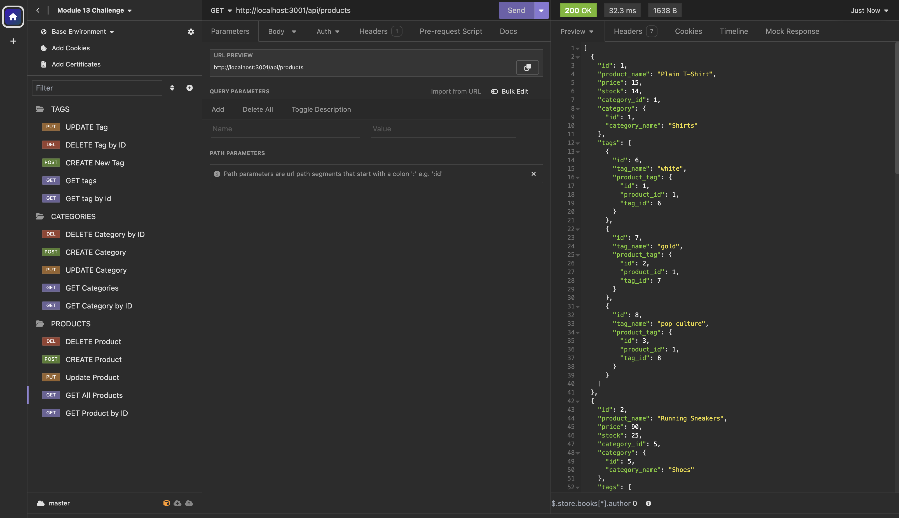

# E-Commerce Backend

<br>


[](https://github.com/ChrisVulpine)

  ## Description
This is a functioning backend for an e-commerce website. The back end takes a working Express.js API and configures it to use Sequelize in order to interact with a MySQL database. It includes routes for categories, products, and tags. 
  
  ## Table of Contents
  
  - [Installation](#installation)
  - [Usage](#usage)
  - [Dependencies](#dependencies)
  - [License](#license)
  - [Credits](#credits)
  - [Questions](#questions)
  
  ## Installation
  Clone this repository to your device and install the dependencies using the following command in your CLI of choice.
   ``` 
  npm install
  ```
  
  ## Usage
  After dependencies have been installed, you can seed the db by using the following command:
  ``` 
  node seeds
  ```

  To start the server run the following command: 
  ``` 
  node server.js
  ```
  This will start the Server on PORT 3001 (default) and Sequelize models will be synced to the MySQL database.

  In order to confirm routes are functioning correctly and returning JSON as expected use an application like [Insomnia](https://insomnia.rest/download).

   You can view a video demo video of the application here: [Demo](https://drive.google.com/file/d/1OF458cBHc5I6JjINqRJFjsu0cQ7PQnMa/view)


  
  ## Dependencies
  * dotenv: https://www.npmjs.com/package/dotenv
  * express: https://www.npmjs.com/package/express
  * mysql2: https://www.npmjs.com/package/mysql2
  * sequelize: https://www.npmjs.com/package/sequelize


  ## Credits

* General Reference: https://www.w3schools.com/
* nodejs docs: https://nodejs.org/docs/latest/api/
* sequelize docs: https://sequelize.org/docs/
* express.js: https://expressjs.com/
* Connecting node.js with mysql: https://www.geeksforgeeks.org/node-js-connect-mysql-with-node-app/
* Readme Badge Generation: https://shields.io/


## License
This project is covered under the [MIT](https://opensource.org/licenses/MIT) license.


## Questions
Got questions? Use the info below to contact me!<br>
GitHub: [@ChrisVulpine](https://github.com/ChrisVulpine/)<br>
Email: [Chrisleach1191@gmail.com](mailto:Chris1191@gmail.com)
